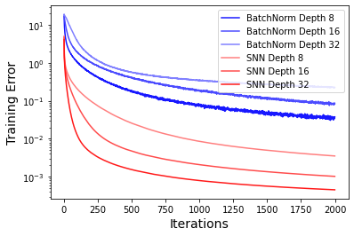

# Self-Normalizing Neural Networks

## Code :
- getSELUparameters.ipynb : Contains the code for finding the parameters of the SELU activation
- SNN_vs_BatchNorm-MNIST.ipynb : Compares the convergence speed of SNNs against Batch Normalization on the MNIST dataset

Datasets Used :
CIFAR 10
- It consists of 60,000 32x32 color images in 10 different classes, with each class representing a specific object or animal. The dataset is evenly split into 50,000 training images and 10,000 testing images.

UCI Machine Learning Repository datasets(optimised)
- It comprises 121 classification datasets from the UCI Machine Learning repository from diverse application areas, such as physics, geology, or biology. The size of the datasets ranges between 10 and 130, 000 data points and the number of features from 4 to 250.

Drug discovery: The Tox21 challenge dataset
- The Tox21 challenge dataset comprises about 12,000 chemical compounds whose twelve toxic effects have to be predicted based on their chemical structure.

Astronomy: Prediction of pulsars in the HTRU2 dataset	
- The High Time Resolution Universe Survey (HTRU2) dataset has been released with 1,639 real pulsars and 16,259 spurious signals.

The Link to the Slides :- https://www.canva.com/design/DAF1LPqjCpc/a6Tagn025IGRirCtB5nnqw/edit?utm_content=DAF1LPqjCpc&utm_campaign=designshare&utm_medium=link2&utm_source=sharebutton
